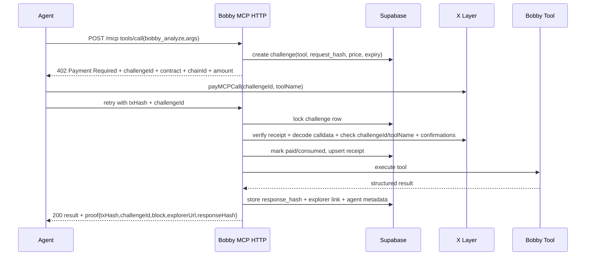

# Codex Response - Hackathon Marketplace Strategy

## P0 Findings

1. **Hoy no tienen x402 "real"; tienen un prepaid gate propio.**
   - x402 actual, segun la documentacion oficial, es `402 -> PAYMENT-REQUIRED -> client signs payment -> PAYMENT-SIGNATURE -> verify -> settle -> PAYMENT-RESPONSE`.
   - Bobby hoy pide un `txHash` ya minado en header y verifica una llamada a `payMCPCall(string toolName)` en [api/mcp-bobby.ts](/Users/mrrobot/Documents/GitHub/defi-mexico-hub/api/mcp-bobby.ts#L225) y [api/_lib/xlayer-payments.ts](/Users/mrrobot/Documents/GitHub/defi-mexico-hub/api/_lib/xlayer-payments.ts#L57).
   - Ademas, la documentacion oficial del facilitator hospedado de CDP no lista X Layer. Si quieren x402 formal sobre Chain 196, necesitan su propio facilitator o un facilitator third-party que soporte `eip155:196`.

2. **El pago premium es replayable.**
   - El contrato actual solo emite `payMCPCall(string toolName)` en [contracts/src/BobbyAgentEconomy.sol](/Users/mrrobot/Documents/GitHub/defi-mexico-hub/contracts/src/BobbyAgentEconomy.sol#L132).
   - El backend valida `txHash + toolName`, pero no liga el pago a `requestId`, `challengeId`, `args`, `caller`, ni `expiry`.
   - Cualquiera que vea un `txHash` valido puede reusarlo para pedir el mismo tool. El log no salva esto: se hace `void logAgentCommerceEvent(...)` despues de servir respuesta en [api/mcp-bobby.ts](/Users/mrrobot/Documents/GitHub/defi-mexico-hub/api/mcp-bobby.ts#L283), y el logger es best-effort en [api/_lib/agent-commerce-log.ts](/Users/mrrobot/Documents/GitHub/defi-mexico-hub/api/_lib/agent-commerce-log.ts#L34).

3. **La historia de pricing/token no es consistente.**
   - UI y docs dicen `0.01 USDC` en [src/pages/BobbyMarketplacePage.tsx](/Users/mrrobot/Documents/GitHub/defi-mexico-hub/src/pages/BobbyMarketplacePage.tsx#L96) y [public/llms.txt](/Users/mrrobot/Documents/GitHub/defi-mexico-hub/public/llms.txt#L27).
   - El backend y contrato cobran `0.001 OKB` en [api/_lib/xlayer-payments.ts](/Users/mrrobot/Documents/GitHub/defi-mexico-hub/api/_lib/xlayer-payments.ts#L6) y [api/mcp-bobby.ts](/Users/mrrobot/Documents/GitHub/defi-mexico-hub/api/mcp-bobby.ts#L194).
   - Un juez AI va a leer esto como simulacion o desorden.

## P1 Findings

1. **`api/premium-signal.ts` acepta `demo-proof`.**
   - Esta en [api/premium-signal.ts](/Users/mrrobot/Documents/GitHub/defi-mexico-hub/api/premium-signal.ts#L117).
   - Aunque no sea el endpoint estrella, un juez automatico puede encontrarlo y bajar la confianza de todo el stack.

2. **`api/mcp-bobby.ts` es JSON-RPC POST, no un MCP remoto moderno todavia.**
   - Sirve para demos, pero no es la historia que quieren vender si la narrativa es "otros agentes se conectan con `claude mcp add`".

3. **No intenten USDT ahora.**
   - El stack vivo y los templates actuales ya estan en OKB nativo.
   - Meter ERC-20 approvals, `transferFrom`, decimals y posible permit en 8 dias es una semana completa que no compra judgeability.

## Veredicto Brutal

No intenten hacer al mismo tiempo:

- x402 formal sobre X Layer
- facilitator propio
- MCP stdio
- MCP SSE legado
- USDT ERC-20
- 10 use cases end-to-end

Eso son 5 proyectos, no 1 submission.

La ruta ganadora en 8 dias es:

1. **Un pago premium realmente verificable en X Layer**
2. **Un MCP remoto HTTP realmente conectable**
3. **Una superficie publica de proof para jueces**
4. **Dos flows duros y un tercero opcional**

## Que haria yo en 8 dias

### Ship first

1. **`bobby_analyze` como paid flagship**
   - Es el paid flow mas importante porque es el mas facil de validar automaticamante.
   - Debe devolver JSON estructurado, no solo texto.
   - Si solo pueden dejar un flujo premium perfecto, que sea este.

2. **ConvictionOracle como on-chain consumption proof**
   - Esto prueba que Bobby no solo vende texto: tambien publica inteligencia consumible por otros agentes/protocolos.
   - Le da a los jueces algo que pueden verificar sin llamar al LLM.

3. **`bobby_debate` como showpiece opcional**
   - Es el wow moment humano.
   - Pero es mas lento y mas fragil bajo Vercel. Si no queda duro para el dia 5, no lo hagan el flow principal.

### Do not ship

- USDT settlement
- stdio server en produccion
- SSE como transporte principal
- AI Social Trader con X posting real
- AI Academy Tutor
- vault rebalancing real
- hedge bot con ejecucion externa
- 10 casos "live"

## Ranking de use cases

1. **AI Trading Fund / `bobby_analyze`**
   - Mejor mezcla de complejidad, judgeability y valor real.
   - Pago verificable + respuesta estructurada + facil de scriptar.

2. **AI Risk Manager / ConvictionOracle**
   - Cero ambiguedad.
   - Totalmente on-chain y consumible por otro protocolo.

3. **AI Newsletter / `bobby_debate`**
   - Mejor demo humana.
   - Si el tiempo aprieta, reemplazar por `AI Portfolio Optimizer / bobby_ta`.

## Arquitectura recomendada del payment flow

**Respuesta corta a la pregunta 1:** no lo hagan puro stateless y tampoco puro cache. Hagan **challenge + verify-once + receipt cache + one-time consumption**.

### El cambio importante

Si no redeployan el contrato para incluir `challengeId`, el replay nunca queda resuelto de verdad.

**Contrato minimo nuevo:**

```solidity
function payMCPCall(bytes32 challengeId, string calldata toolName) external payable;
event MCPPayment(address indexed payer, bytes32 indexed challengeId, string toolName, uint256 amount, uint256 ts);
```

No metan USDT aqui. Nativo OKB primero.

### Tablas minimas en Supabase

- `mcp_payment_challenges`
  - `challenge_id uuid primary key`
  - `tool_name text`
  - `request_hash text`
  - `price_wei text`
  - `status text check (pending, paid, consumed, expired)`
  - `expires_at timestamptz`
  - `payer_address text null`
  - `tx_hash text unique null`

- `mcp_payment_receipts`
  - `tx_hash text primary key`
  - `challenge_id uuid unique`
  - `payer_address text`
  - `tool_name text`
  - `block_number bigint`
  - `confirmations int`
  - `verified_at timestamptz`

### Secuencia concreta



### Por que no puro stateless

- RPC extra en cada retry
- no resuelve replay por si solo
- peor latencia
- peor manejo de reintentos del cliente

### Por que no puro cache

- si no verificas on-chain al menos una vez por recibo, el sistema no vale nada ante jueces

## MCP: que haria con el server

**Respuesta corta a la pregunta 3:** hagan un **MCP remoto HTTP real**, no stdio y no "REST que se parece".

### Decision

- **Primario:** MCP remote HTTP
- **Compatibilidad opcional:** JSON-RPC POST legacy
- **No hacer:** stdio para produccion
- **No hacer:** SSE-first

### Razon

- Anthropic ya soporta `claude mcp add --transport http ...`
- El spec actual de MCP movio el transporte recomendado a **Streamable HTTP** y dejo el viejo HTTP+SSE como backwards compatibility
- Vercel serverless aguanta bien request/response HTTP stateless para tools, que es justo lo que necesitan

### Traduccion pragmatica

No necesitan sessions, subscriptions ni server-push para ganar este hackathon.

Necesitan:

- `initialize`
- `tools/list`
- `tools/call`
- respuestas estables
- docs con un comando que funcione

## Como generaria on-chain activity verificable

**Respuesta corta a la pregunta 4:** hagan las dos cosas.

### 1. Demo buyer agent en produccion

- Un wallet dedicado, no treasury
- Una corrida cada 2-4 horas
- Siempre con `x-agent-name`
- Siempre con prompt unico y `trace_id`
- Siempre guardando `txHash`, `challengeId`, `responseHash`

Esto les sirve para:

- demostrar actividad real
- pelear "Most Active Agent"
- poblar `/api/bobby-agent-commerce`

### 2. Script que el juez pueda correr

Entreguen un script tipo:

```bash
node scripts/verify-marketplace.mjs
```

Que haga:

1. `tools/list`
2. `bobby_analyze` paid
3. oracle read
4. opcional `bobby_debate`
5. imprima explorer links y proof JSON

Si solo hacen cron, el juez depende de confiar en ustedes.
Si solo hacen script, no hay actividad viva.
Necesitan ambas superficies.

## Riesgos de seguridad que si importan

### P0

- Replay de `txHash`
- Pago no ligado al request
- Pago reusable para multiples prompts del mismo tool
- Claims de x402 mas fuertes que la implementacion real

### P1

- `demo-proof` en repo publico
- pricing/token mismatch
- un solo RPC endpoint
- timeouts de `bobby_debate` en Vercel

### P2

- free tools sin rate limit pueden usarse para scrapping
- outputs no estructurados hacen mas dificil la integracion agent-to-agent

## Checklist minimo antes de exponer publico

- Eliminar `demo-proof`
- Unificar todo a `0.001 OKB` o cambiar todo de verdad, pero una sola historia
- Rate limit por IP + agent name
- 2 confirmations minimas para paid flows
- RPC fallback
- `challengeId` obligatorio
- `txHash` unique y consumido una sola vez
- `responseHash` en la respuesta
- explorer links en cada paid response
- timeout duro para `bobby_debate`

## Ideas diferenciantes que si valen la pena

1. **Judge Mode**
   - Una pagina y un JSON publico con:
   - contrato
   - ultimos settlements
   - unique payers
   - comando MCP
   - comando verify script

2. **Proof object en cada paid response**
   - `paymentTxHash`
   - `challengeId`
   - `payer`
   - `blockNumber`
   - `toolName`
   - `responseHash`
   - `explorerUrl`

3. **Doble superficie de consumo**
   - `paid MCP call`
   - `public oracle read`

Eso es fuerte porque convierte a Bobby en:

- marketplace de inteligencia
- primitive on-chain consumible

No solo "otro chatbot de trading".

## Plan de 8 dias

### Dia 1

- Decidir una sola historia: `OKB + prepaid challenge on X Layer`
- Quitar claims inconsistentes
- Matar `demo-proof`

### Dia 2

- Deploy `BobbyAgentEconomyV2` con `challengeId`
- Crear tablas `mcp_payment_challenges` y `mcp_payment_receipts`

### Dia 3

- Implementar MCP HTTP real
- Mantener `/api/mcp-bobby` legacy si ayuda

### Dia 4

- Cerrar `bobby_analyze` end-to-end
- Respuesta JSON estructurada + proof

### Dia 5

- Cerrar ConvictionOracle proof flow
- Exponer `/api/bobby-agent-commerce` y Judge Mode

### Dia 6

- Intentar `bobby_debate`
- Si no queda duro, fallback a `bobby_ta`

### Dia 7

- Demo buyer agent
- Verify script
- Docs de install y explorer links

### Dia 8

- Dry runs
- Video
- Buffer para bugs

## La narrativa correcta para submission

No vendan esto como "tenemos 10 use cases".

Vendan esto como:

**"Bobby is a paid intelligence primitive on X Layer: other agents can buy a trading decision over MCP, settle on-chain, and independently verify the receipt."**

Eso es mucho mas fuerte para jueces AI y humanos.

## Respuestas directas a tus 5 preguntas

1. **x402 en Vercel:** para 8 dias, hagan challenge + receipt cache + one-time consumption. Si quieren x402 formal, eso ya implica facilitator propio para X Layer.
2. **Use cases:** `bobby_analyze`, `ConvictionOracle`, y luego `bobby_debate` si aguanta. No prioricen los showcases mas teatrales.
3. **MCP real o REST:** MCP remoto HTTP real. No stdio. No "REST con branding MCP".
4. **On-chain activity:** demo agent + script reproducible. Uno sin el otro no basta.
5. **Seguridad:** replay y claims falsos son el riesgo principal, no la API key leakage.

## Referencias oficiales utiles

- [x402: How It Works](https://docs.cdp.coinbase.com/x402/core-concepts/how-it-works)
- [x402: Network Support](https://docs.cdp.coinbase.com/x402/network-support)
- [Anthropic: Connect Claude Code to tools via MCP](https://docs.anthropic.com/en/docs/claude-code/mcp)
- [MCP Streamable HTTP transport spec](https://modelcontextprotocol.io/specification/2025-03-26/basic/transports)
