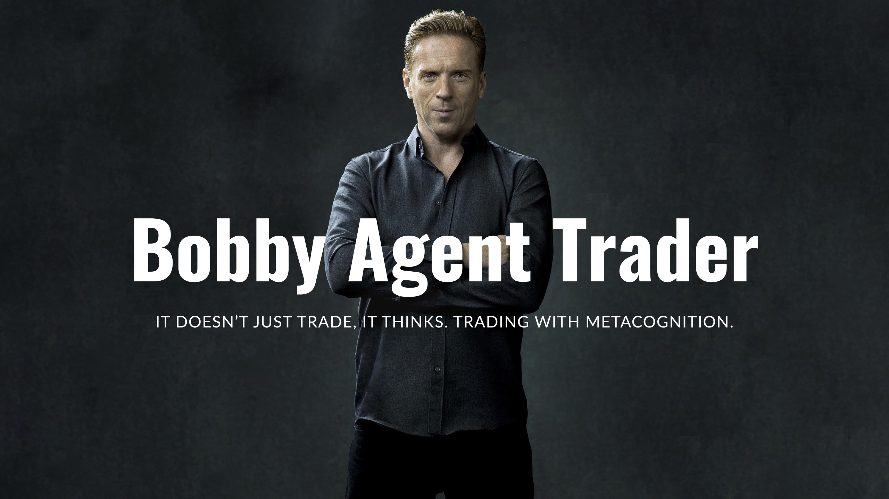

<div align="center">



# Bobby Agent Trader

### *It doesn't just trade. It thinks.*

**Autonomous DeFi Trading Agent with Metacognition**

[](https://www.okx.com)
[](https://defimexico.org/bobby)
[](https://anthropic.com)
[](https://www.okx.com/web3)

---

*"The divergence between what people believe and what money does — that's where alpha lives."*
— Bobby

</div>

## What is Bobby?

Bobby is an **autonomous DeFi trading agent** — named after Bobby Axelrod from *Billions* — that combines **OKX OnchainOS whale intelligence**, **Polymarket smart money consensus**, and a **multi-agent debate system** to make trading decisions with visible metacognition.

Unlike typical trading bots that execute signals blindly, Bobby **thinks out loud**. Every decision goes through an internal debate between three agents, and the user sees it happening in real-time.

## Architecture

```
                          USER (Chat / Voice)
                                |
                    +-----------+-----------+
                    |    Bobby Interface     |
                    |  Voice + Typewriter    |
                    |  Intelligence Console  |
                    +-----------+-----------+
                                |
                    +-----------+-----------+
                    |    bobby-intel.ts      |
                    |  Fast Intelligence     |
                    |  Pipeline (~10-15s)    |
                    +-----------+-----------+
                                |
              +-----------------+-----------------+
              |                 |                 |
    +---------+------+ +-------+--------+ +------+---------+
    | OKX OnchainOS  | | Polymarket     | | Historical     |
    | Whale Signals   | | Smart Money    | | Performance    |
    | (ETH/SOL/Base)  | | Consensus      | | (Supabase)     |
    +---------+------+ +-------+--------+ +------+---------+
              |                 |                 |
              +-----------------+-----------------+
                                |
                    +-----------+-----------+
                    |  Dynamic Conviction    |
                    |  Score Engine          |
                    |  (OKX×0.4 + Poly×0.6  |
                    |   - latencyPenalty)    |
                    +-----------+-----------+
                                |
              +-----------------+-----------------+
              |                 |                 |
    +---------+------+ +-------+--------+ +------+---------+
    | ALPHA HUNTER   | | RED TEAM       | | BOBBY CIO      |
    | "Buy signal    | | "Whale outflow | | "EXECUTE at     |
    |  detected"     | |  contradicts"  | |  0.82 conviction|
    +---------+------+ +-------+--------+ |  Kelly: $37.50" |
              |                 |          +------+---------+
              +-----------------+-----------------+
                                |
                    +-----------+-----------+
                    |   DEX Execution       |
                    |   (OKX DEX Widget)    |
                    +---+-------+-----------+
                        |       |
                   Ethereum  Solana  Base  X Layer
```

## Key Features

### Multi-Agent Debate (Visible Metacognition)
The core innovation. Three AI agents debate every trading decision:
- **Alpha Hunter** — finds opportunities from whale signals and market data
- **Red Team** — adversarial agent that tries to destroy every thesis
- **Bobby CIO** — makes the final call with a conviction score

The debate is **visible to the user** in the Intelligence Console, not hidden in logs.

### Dynamic Conviction Score
Math-first approach — Claude doesn't do the arithmetic:
```
Conviction = (OKX_Score × 0.4) + (Poly_Consensus × 0.6) - Latency_Penalty
```
- Signals older than 60 minutes are penalized exponentially
- Sub-5-minute signals get full weight
- Score drives Kelly Criterion position sizing

### Safe Mode (Self-Recalibration)
Bobby monitors its own performance across cycles:
- **Win rate > 70%** → Confident mode (green). Full conviction.
- **Win rate 50-70%** → Cautious mode (amber). Reduced exposure.
- **Win rate < 50%** → Safe Mode (red). Halved position sizes. "Markets are hostile. Preserving capital."

### OKX OnchainOS Integration
- **Whale Signal Scanner** — Real-time net flows across ETH, SOL, Base, X Layer
- **DEX Widget** — One-click swap execution via OKX DEX aggregator
- **CEX Market Data** — Live prices for BTC, ETH, SOL, OKB, XAUT, PAXG
- **Smart Money Tracking** — On-chain truth vs speculative consensus

### Polymarket Intelligence
- Scans top 50 PnL traders' positions
- Aggregates capital-weighted consensus
- Detects divergence between smart money consensus and market price
- Sankey flow visualization of capital allocation

### Voice-First Personality
Bobby speaks with the voice of a sovereign CIO. Mexican Spanish by default, switches to English when addressed in English. No disclaimers. No fluff. Pure signal.

## Tech Stack

| Layer | Technology |
|-------|-----------|
| Frontend | React 18 + TypeScript + Vite |
| Styling | Tailwind CSS + Framer Motion |
| AI Engine | Claude Sonnet 4 (Anthropic) |
| Agent Framework | OpenClaw Gateway |
| On-Chain Data | OKX OnchainOS API |
| Market Intel | Polymarket (Gamma + CLOB + Data APIs) |
| Database | Supabase (PostgreSQL) |
| Voice | Web Speech API (TTS) |
| Deployment | Vercel (Serverless Functions) |
| DEX Execution | OKX DEX Widget |

## API Endpoints

| Endpoint | Purpose | Timeout |
|----------|---------|---------|
| `/api/bobby-intel` | Fast intelligence pipeline (whale signals + consensus + prices) | 30s |
| `/api/openclaw-chat` | Conversational AI (OpenClaw → Claude fallback) | 60s |
| `/api/agent-run` | Full autonomous cycle (scan → debate → execute) | 120s |
| `/api/bobby-voice` | Voice synthesis for Bobby personality | 30s |

## Running Locally

```bash
git clone https://github.com/anthonysurfermx/defi-mexico-hub.git
cd defi-mexico-hub
npm install
cp .env.example .env.local
npm run dev
```

### Environment Variables

```env
# OKX OnchainOS
VITE_OKX_PROJECT_ID=your-project-id
VITE_OKX_API_KEY=your-api-key
VITE_OKX_SECRET_KEY=your-secret-key
VITE_OKX_PASSPHRASE=your-passphrase

# AI
ANTHROPIC_API_KEY=your-claude-key
OPENCLAW_GATEWAY_URL=https://your-gateway.url
OPENCLAW_TOKEN=your-token

# Supabase
VITE_SUPABASE_URL=your-project.supabase.co
VITE_SUPABASE_ANON_KEY=your-anon-key
SUPABASE_SERVICE_ROLE_KEY=your-service-key
```

## The Philosophy

> "Everyone else is building bots that read signals and push buttons. Bobby reads signals, **debates them internally**, **assigns a conviction score**, **checks its own track record**, and only then decides — while explaining its reasoning out loud. That's not a bot. That's a trader."

The hackathon criteria is clear: **AI + DeFi + OKX integration**. Bobby delivers all three, but the differentiator is **metacognition** — the agent that knows what it knows, knows what it doesn't, and adapts its behavior accordingly.

## Team

**Anthony Chavez** — Founder & Lead Developer
- [GitHub](https://github.com/anthonysurfermx) | [Twitter](https://twitter.com/anthonysurfermx)

Built for the **OKX X Layer AI Hackathon 2026** (March 12-26)

---

<div align="center">

**Bobby Agent Trader** — *Trading with Metacognition*

Powered by **OKX OnchainOS** | **Claude AI** | **Polymarket Intelligence**

</div>
