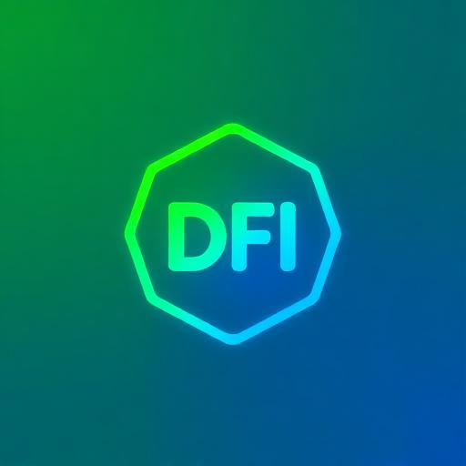

<div align="center">
  
  
  # 🚀 DeFi México Hub
  
  **El centro de innovación blockchain y DeFi en México**
  
  [](https://defimexico.org)
  [](https://react.dev)
  [](https://supabase.com)
  [](https://www.typescriptlang.org)
  
  ---
  
  ### 🇲🇽 Construido con amor por mexicanos, para mexicanos 🇲🇽
  
</div>

## ✨ Características

- 🚀 **Directorio de Startups** - Descubre las empresas blockchain más innovadoras de México
- 👥 **Comunidades Activas** - Conecta con miles de entusiastas DeFi
- 📊 **Panel de Administración** - Gestión completa de contenido
- 🔐 **Autenticación Segura** - Sistema robusto con Supabase Auth
- 📱 **100% Responsive** - Experiencia perfecta en cualquier dispositivo
- ⚡ **Alto Rendimiento** - Optimizado con Vite y React 18

## 🛠️ Stack Tecnológico

- **Frontend:** React 18, TypeScript, Vite
- **Estilos:** Tailwind CSS, Shadcn/ui
- **Base de Datos:** Supabase (PostgreSQL)
- **Autenticación:** Supabase Auth
- **Deployment:** Vercel
- **Icons:** Lucide React
- **Animaciones:** Framer Motion

## 🚀 Instalación Rápida

### Prerrequisitos
- Node.js 18+ 
- npm o yarn
- Cuenta en [Supabase](https://supabase.com)

### Pasos de Instalación

1. **Clona el repositorio**
   ```bash
   git clone https://github.com/anthonysurfermx/defi-mexico-hub.git
   cd defi-mexico-hub
   ```

2. **Instala las dependencias**
   ```bash
   npm install
   ```

3. **Configura las variables de entorno**
   ```bash
   cp .env.example .env.local
   ```
   
   Edita `.env.local` y agrega tus keys de Supabase:
   ```
   VITE_SUPABASE_URL=tu-proyecto-url.supabase.co
   VITE_SUPABASE_ANON_KEY=tu-anon-key
   ```

4. **Configura la base de datos**
   
   Ve a tu dashboard de Supabase y ejecuta los scripts SQL en la carpeta `supabase/migrations/`

5. **Inicia el servidor de desarrollo**
   ```bash
   npm run dev
   ```

6. **Abre tu navegador**
   ```
   http://localhost:8080
   ```

## 📁 Estructura del Proyecto

```
defi-mexico-hub/
├── src/
│   ├── components/         # Componentes React reutilizables
│   ├── pages/             # Páginas de la aplicación
│   │   ├── admin/         # Panel de administración
│   │   └── ...           
│   ├── services/          # Servicios de datos
│   ├── hooks/             # Custom React hooks
│   ├── lib/              # Utilidades y configuración
│   │   └── supabase.ts   # Cliente de Supabase
│   └── types/            # TypeScript types
├── public/               # Assets estáticos
├── scripts/              # Scripts de migración
└── supabase/            # Configuración de base de datos
```

## 🎯 Roadmap

### ✅ Completado
- ✔️ Landing page
- ✔️ Directorio de startups
- ✔️ Sistema de comunidades
- ✔️ Panel de administración
- ✔️ Autenticación
- ✔️ Eventos y calendario
- ✔️ Blog/Recursos

### 🚧 En Desarrollo
- 🔄 Sistema de comentarios
- 🔄 Analytics dashboard
- 🔄 Notificaciones
- 🔄 Newsletter

### 💡 Próximamente
- 📱 App móvil
- 🔗 Integración con wallets
- 🏆 NFT badges
- 🗳️ DAO governance
- 📊 API pública

## 🤝 Contribuir

¡Amamos las contribuciones! DeFi México Hub es un proyecto open source y comunitario.

1. Fork el proyecto
2. Crea tu feature branch (`git checkout -b feature/AmazingFeature`)
3. Commit tus cambios (`git commit -m 'Add: Nueva característica increíble'`)
4. Push a la branch (`git push origin feature/AmazingFeature`)
5. Abre un Pull Request

### Guía de Contribución
- Usa TypeScript para todo el código nuevo
- Sigue las convenciones de React 18
- Escribe código limpio y comentado
- Actualiza la documentación si es necesario
- Incluye tests cuando sea posible

## 👥 Equipo

<div align="center">
  
### Creado con 💜 por

**Anthony Chavez**  
*Founder & Lead Developer*  
[LinkedIn](https://linkedin.com/in/anthonychavez) | [Twitter](https://twitter.com/anthonysurfermx)

### Con el poder de

**Un equipo increíble de IA 🤖**  
*Asistentes que hicieron posible este proyecto*

</div>

## 📄 Licencia

Este proyecto está bajo la Licencia MIT - mira el archivo [LICENSE](LICENSE) para más detalles.

## 🌟 Agradecimientos

- A toda la comunidad DeFi México
- A los early adopters y primeros usuarios
- A todos los que creen en el futuro descentralizado de México
- A ti, por estar aquí leyendo esto 💜

## 📞 Contacto

- **Website:** [defimexico.org](https://defimexico.org)
- **Email:** hola@defimexico.org
- **Twitter:** [@DeFiMexicoHub](https://twitter.com/DeFiMexicoHub)
- **Discord:** [Únete a nuestra comunidad](https://discord.gg/defimexico)

---

<div align="center">
  
⭐ **Si te gusta este proyecto, dale una estrella!** ⭐

**Hecho con ❤️ en México 🇲🇽**

[defimexico.org](https://defimexico.org)

</div>